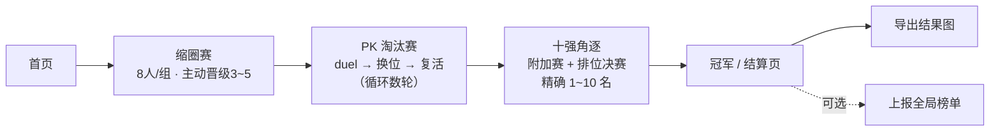
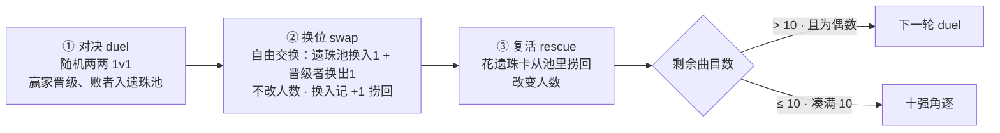
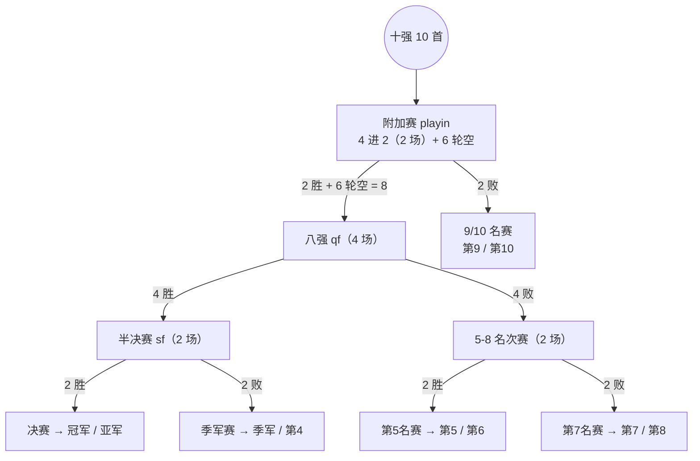
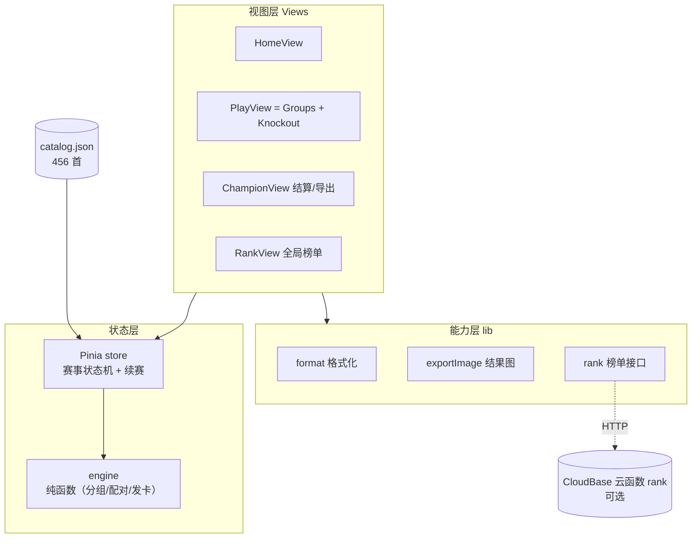
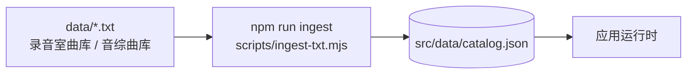

# Shencup · 周深全曲库对决

> 周深全曲库「世界杯式」1v1 对决 Web 应用。无需注册、点开即玩；墨金视觉、面向国内、非官方粉丝作品。

把一整座曲库（530 首：录音室 327 + 音综 129 + 舞台 74）扔进随机签表，缩圈、两两 PK、换位翻盘、遗珠捞回，一路角逐出**十强**与**冠军**，最后导出可分享的结果图、把战绩上报到全局榜单。

---

## 目录

- [一、玩一局会经历什么](#一玩一局会经历什么)
- [二、赛制机制详解](#二赛制机制详解)
- [三、技术架构](#三技术架构)
- [四、数据流水线](#四数据流水线)
- [五、目录结构](#五目录结构)
- [六、本地开发](#六本地开发)
- [七、部署](#七部署)

---

## 一、玩一局会经历什么



- **无需注册**，点击即玩；进度自动存在本机（`localStorage`），可断点续赛。
- **缩圈赛淘汰的曲目**不再进入后续数据，但会成为当轮遗珠池、可被捞回。
- 全程纯元数据（**无封面、无试听**），靠曲名 + 专辑 + 备注做选择。

---

## 二、赛制机制详解

### 2.1 阶段总览

| 阶段 | phase | 做什么 |
| --- | --- | --- |
| 首页 | `home` | 入口、继续未完成的对局 |
| 缩圈赛 | `groups` | 全曲库随机分 8 人/组，每组**主动晋级 3~5** 首，未选的进遗珠池 |
| 淘汰赛 | `knockout` | 两两 PK；每轮 duel→换位→复活，循环到剩 ≤10 首 |
| 冠军 | `champion` | 十强附加赛 + 排位决赛，排出精确 1~10 名 |

### 2.2 缩圈赛（R1）

- 全曲库随机均分为 **8 人/组**。
- 每组用户**主动点选 3~5 首晋级**（组越大上限越高，保证每组至少留 3 首）。
- **未选的曲目 = 当轮遗珠**，累积进遗珠池；缩圈全部结束后，进入「缩圈遗珠」复活环节一次性发放遗珠卡捞回。

### 2.3 PK 轮的三段式流程

每一轮 PK 都按 **对决 → 换位 → 复活** 三段推进：



**三种「卡」**（都不强制使用完，也不跨轮累计）：

| 卡 | 作用 | 对人数 |
| --- | --- | --- |
| 换位卡 | 遗珠池换入 1 首、同时晋级者换出 1 首（自由配对） | 不变 |
| 遗珠卡 | 从遗珠池捞回 1 首进晋级者 | +1 |

> **换位 ≠ 复活**：换位是「1 换 1」纠错（你觉得某场比错了，把败者换上来、胜者换下去），人数不变；复活是「凭空捞回」，人数增加。换入的曲目记一次**捞回**。

#### 换位卡发放（按轮次）

| PK 轮 | 1~3 轮 | 4~5 轮 | 6 轮及以后 | 缩圈轮 |
| --- | --- | --- | --- | --- |
| 换位卡 | 5 | 3 | 1 | 无 |

#### 遗珠卡发放（按轮次 × 赛后剩余奇偶）

`e` = 赛后剩偶数 / `o` = 赛后剩奇数：

| 轮次 | 缩圈后 | PK 1 | PK 2 | PK 3 | PK 4 | PK 5 | PK 6 | PK 7 | ≥8 轮 |
| --- | --- | --- | --- | --- | --- | --- | --- | --- | --- |
| 偶 e | 20 | 16 | 12 | 10 | 6 | 6 | 4 | 2 | 2 |
| 奇 o | 19 | 17 | 11 | 11 | 7 | 5 | 5 | 3 | 1 |

> 卡数随轮次递减、且与剩余奇偶对齐，使得**非十强轮总能凑成偶数**进入下一轮（已用模拟验证无死锁）。

### 2.4 十强收口（替代旧的「八强」）

某轮对决后，赢家数 `n` 决定是否收口：

| n | 行为 |
| --- | --- |
| `n > 10` | 正常进入换位 + 复活，下一轮继续 |
| `n = 10` | 发 **1 张换位卡**，直接进十强角逐 |
| `n < 10` | 发 **1 张换位卡 + (10−n) 张遗珠卡**，补满 10 首后进十强角逐 |

### 2.5 十强决赛（精确排出 1~10 名）

10 首先打 **附加赛**（随机取 4 首打 2 场，余 6 首轮空）→ 决出 8 强与 9/10 名，再走完整排位赛：



共 **15 场**对决，覆盖第 1~10 名全部位次。

### 2.6 捞回 · 梯队 · 皇族

结算与上报围绕三个衍生概念：

- **捞回次数** = 复活次数 + 换位（换入）次数，按曲目全程累计（存于 `rescues`）。是「遗珠榜」与「十强捞回标注」的依据。
- **梯队** = 每个 PK 轮的入场阵容（早→晚记录）。**倒数第一轮 = 第一梯队**、**倒数第二轮 = 第二梯队**，在结果图与结算页高亮。
- **皇族** = 进入十强的曲目里，**捞回次数最少**的几首（凭实力进十强、而非被反复捞回）。本局取前 3，全局为独立榜单。

---

## 三、技术架构

### 3.1 技术栈

- **框架**：Vue 3（`<script setup>` + Composition API）+ Vite + TypeScript
- **状态**：Pinia（setup store）+ `localStorage` 续赛持久化
- **路由**：Vue Router（hash 模式，适配静态托管子路径刷新）
- **赛事引擎**：纯函数（`src/engine/tournament.ts`），可独立单测
- **结果图**：Canvas 2D 手绘版式 + `qrcode` 生成二维码
- **后端**（可选）：腾讯云开发 CloudBase 云函数，前端 `fetch` 直连，不引 SDK

### 3.2 分层



### 3.3 状态机

`src/stores/tournament.ts` 是核心。阶段 `phase`：`home → groups → knockout → champion`；淘汰赛内部用 `knockSub`（`duel | swap | rescue`）切子阶段；十强决赛用 `fStage`（`playin | place9 | qf | place57sf | sf | place7 | place5 | place3 | final`）走排位赛。

关键状态：`survivors`（晋级者）、`roundPool`（当轮遗珠池，不跨轮）、`cards`/`swapCards`（两种卡）、`rescues`（捞回次数表）、`tiers`（每轮阵容）、`ranks`（1~10 名）、`roundSwaps`（换位记录，供撤回）。

### 3.4 续赛持久化

- 整局快照写入 `localStorage`，key 随版本升级（当前 `shencup:v7`）。
- **旧版本快照不恢复**（结构不兼容时直接重开），避免脏数据卡死。
- 全局 watch 深度监听所有状态字段，任意变化即落盘。

### 3.5 全局榜单与「未上报锁定」

- 5 个榜：**冠军榜 / 亚军榜 / 十强榜 / 遗珠榜（捞回次数）/ 皇族榜**（皇族 = 十强曲目按捞回次数升序，前端从 `topTens`+`rescues` 派生，无需后端新字段）。
- **毛玻璃锁定**：本机未上报过任何一局时，榜单具体排名以毛玻璃遮罩隐藏；完成一局并「上报榜单」后（本地 `shencup:submitted` 标记）解锁——避免跟风投票。
- 每个浏览器限上报 5 次（后端用 token 计数 + 按局 runId 去重，防同一局重复刷数）。

### 3.6 结果图

`src/lib/exportImage.ts` 用 Canvas 手绘墨金版式，**两遍布局**（先测量高度、再绘制），版式自上而下：品牌头 → 冠军 → 十强（带捞回）→ 第一梯队 → 第二梯队 → 遗珠 Top10 → 页脚 + 右下角**二维码**（指向站点首页）。

---

## 四、数据流水线



- 曲库以纯文本维护：`data/录音室曲库.txt`（`《歌名》` 格式）、`data/音综曲库`（`（歌名）` 格式，无扩展名）。
- `ingest-txt.mjs` 解析两种格式，**文件名即赛道**（录音室 / 音综）；自动提取「节目+期/季」作 `note`，音综自动加 ` (Live)` 后缀，与录音室同名的音综自动去重，合并生成 `catalog.json`。
- 每首含：`id / title / album / year / division / note（备注）/ seed`。无封面、无试听。

---

## 五、目录结构

```
src/
  engine/tournament.ts   赛事引擎（纯函数：分组/配对/发卡表）
  stores/tournament.ts   赛事状态机 + 续赛持久化（核心）
  types.ts               Song / RunSummary 等类型
  views/                 Home / Play(Groups+Knockout) / Champion / Rank
  lib/
    format.ts            专辑·年份·备注 行格式化
    exportImage.ts       Canvas 结果图 + 二维码
    rank.ts              全局榜单接口 + 上报/已上报标记
  styles/                墨金设计令牌(tokens) + 全局样式(base)
  data/catalog.json      摄取产物（456 首）
functions/rank/          CloudBase 云函数（get/submit）
scripts/
  ingest-txt.mjs         txt → catalog.json
  selftest.ts            引擎/赛制自检
data/                    曲库源文件（*.txt）
```

---

## 六、本地开发

```bash
npm install
npm run ingest          # data/*.txt → src/data/catalog.json
npm run dev             # http://localhost:5173

# 自检
npx vue-tsc --noEmit    # 类型检查
node scripts/selftest.ts# 引擎/赛制自检（含十强排位模拟）

npm run build           # 产物 dist/
```

> 选歌后会有 ~0.48s 胜负高亮停留再翻页，便于看清结果。

---

## 七、部署

面向国内、免备案先用平台子域名上线，自定义域名后补 ICP 备案。**主流程（筛选/淘汰/冠军/导出）不依赖后端**，可纯静态先上线，榜单随后补。完整步骤见 [DEPLOY.md](DEPLOY.md)。

- **前端**：腾讯云开发 CloudBase 静态托管，上传 `dist/` 即得 `*.tcloudbaseapp.com` 默认域名。
- **后端（可选）**：部署云函数 `functions/rank`，开启 HTTP 访问，把地址填入 `.env` 的 `VITE_CB_URL`。留空则榜单优雅降级为空，主流程不受影响。

---

非官方粉丝向作品，仅供同好娱乐。
